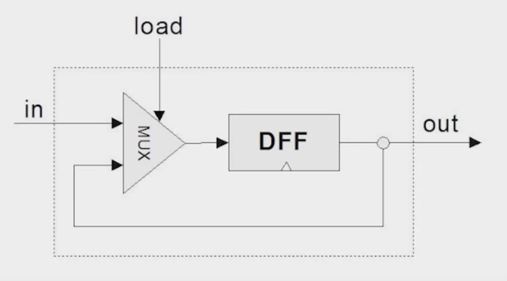

# Nand2Tetris Part I

- https://www.coursera.org/learn/build-a-computer/home/week/1
- https://www.nand2tetris.org/book

## Week 1 - Basic Logic Gates (Not too hard)

**Unit 1.1** How to construct function from Truth table
- Start with the first row of value one. Come up with a function that only satisfies that row 
- Go to next row that has value one and do the same
- Repeat for all rows of value one, then `OR` all those statements together
- Then simplify the expression using laws
	- There is no efficient algorithmn for finding the shortest expresssion. This is an NP hard problem.
- Every possible boolean function can be constructed using `AND`, `OR` and `NOT`. But we can simplify further to just use `NAND`:
	-  `OR` can be constructed from `AND` and `NOT` using Demorgan laws `X OR Y === NOT(NOT X AND NOT Y)`
	- `NAND` is the negation of `X AND Y`. This suffices to construct all others since we can define `AND` and `NOT` in terms of `NAND`.
	- `NOT X === X NAND X`
	- `X AND Y === NOT(X NAND Y) === (X NAND Y) NAND (X NAND Y)`

**Unit 1.6** Handling multiple input as buses
- Convenient to treat groups of inputs as a single 'bus'
- Has support in HDL for it

**Questions**
- You can build computers primitives other than `NAND` such as `NOR`. Depends on the physical implementation, costs etc.

## Week 2 - Build ALU (Not too hard)

- We only need addition to be able to perform other functions such as negation and comparisons
- Can build adders for single bits, and 16 bits

**Unit 2.3** Negation
- Using a sign bit is ineligant and inefficient (can represent 0 and -0)
- Overflow of MSB we normally just throw away. We end up with module `2^n`.
- Twos complement
	- Negative is represented by `2^n-x`
	- We get an extra negative number 0-7 and -1 to -8 for 16 bits
	- We can add negative numbers using a regular adder and get the correct result
		- Because `y - x == y + (-x)`
	- To compute the twos complement:
		- Flip the binary bits and add one
		- This is a math trick. We rewrite `2^n-x` as `1+(2^n-1)-x`. Since `2^n-1` is always all ones in binary. Subtracting from this is easy because you don't need any borrows (carries) so it becomes a simple `Not` operation i.e. flip the bits. Then we simply add back the one we subtracted.

**Unit 2.4** ALU
- The `ALU` (Arithmetic Logic unit) computes a function on two inputs and outputs the results. It can compute many functions such as `Add`, `Or`, `Xor` etc. and the function computed simply depends on the bit flags passed into it thus making it a general purpose computational unit.


## Week 3 - Build Memory Registers (Pretty hard)

State is stored (temporarily) using a `Clocked Data Flop Flop (DFF)`. This is a gate that outputs the value put into it from the previous time unit. Thus we require a concept of time. This time state is built into the `DFF` chip making it Sequential rather than Combinatorial.

To build memory, we need the ability to choose between loading a new value or reading the existing from the `DFF`. We do this using a `Mux` which take a load bit as the selector. Input from the `DFF` is fed back into the `Mux` along with the original input, thus we either load a new bit into the `DFF` and read it, or we keep loading it back into itself and reading it. 



This creates a 1-bit memory. We can combines these into a `word` of 16 bits. In practice this can be any width.

We can then create a `Register` which takes a load bit and an address bit. We simply `Mux` among the registers based on the address and load or read from the selected register thus creating addressable memory.

Larger memory units can be created by combining smaller ones and increasing the address size based on `log(n)` where `n` in the number of words we want the ability to remember.

We can create a Program Counter by using our new memory. Useful for things like tracking which lines of code to execute.

**Notes**
I struggled with the PC.hdl and Bit.hdl. Keep forgetting how to split outs for proper execution. Difficult to grok how the PC uses the memory to keep track of state, wanted a real IF statement to switch between reading and writing to memory.  PC.hdl solution is actually very similar to Bit.hdl

## Week 4 - Write Machine Code (Not too hard)

- General Purpose computer (Von Neumann Architecture) allows us to store program code that can make the machine compute any possible program.
- Operations can be represented as binary words.
- Machine Code is the binary, Assembly is the human readable version. Assembler converts from one to another.
- Memory Hierarchy
	- Memory addresses would become very long if we had to load every operation into/outof a single memory location. We can speed this up by having tiers of memory getting increasingly small and using each as a cache for the previous layer. Typically Disk > Main Memory > Cache > Registers.
- The MSB in a 16 bit binary word is the Op Code.
- A instruction used for storage `@value`
	- opcode `0`
	- value is a 15 bit decimal
	- e.g. `@21` sets A register to 21
- C instruction used for computation `dest = comp; jump`
	- opcode `1`
- Registers
	- `D` register (data) 16 bit value
	- `A` register (address/data) 
	- `M` register (selects a register in RAM), depends on A because `M = RAM(A)`
	- Can label a register by specifying @label on line before assigning to `M`
- Input/Output
	- `@KBD`
	- `@SCREEN`
		- Screen is 32 x 16 pixels (512). Have to jump 32 words at a time for each line.
- End every program with an infinite loop
	- prevents unintended code execution (buffer overflow)
	```
	(END)
		@END
		0;JMP
	```
**Notes**
Pretty familiar as a programmer, just a much reduced set of tools! 

## Week 5 (Super hard) Computer Architecture

- Build CPU - this is where the Machine Language is defined
- Build Memory - Unify the RAM, Keyboard and Screen address spaces
- Build Computer - Put Memory and CPU together with RAM for Harvard Architecture
- Harvard Architecture is a variant of the Von Neumann Architecture
	- Memory is split into ROM and RAM.
	- This makes for a simpler CPU since instructions can be read from ROM at the same time as it is executed and read/writing to RAM. We otherwise would have to perform this in two steps.
- The CPU has it's own registers instead of using the RAM since addressing RAM would consume all 16 bits of the instruction thus requiring two clock cycles for basic operations. By having a small number of registers (2 in this case), we can use a single bit of the instruction to address them, leaving instruction space for other information such as the operation to be performed.
- Device controllers can be used to offload processing for more devices (other than kbd and screen)
	- Memory Mapped IO concept - makes all devices look the same to the CPU
	- Standardization of interaction and mapping method is important
	- Graphics cards are dedicate computers that can do their own computation to do drawing etc. rather than the CPU doing it.


**Notes**
Struggled with the complex rules of the CPU and breaking down the instruction. Lots of documentation to read to figure it out. Also struggled with computing the Jump conditions.